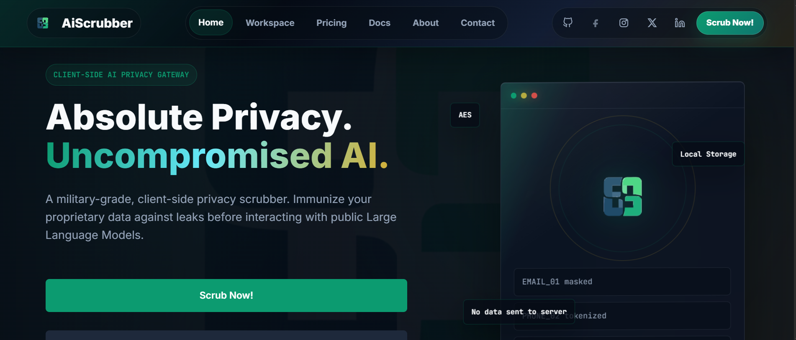
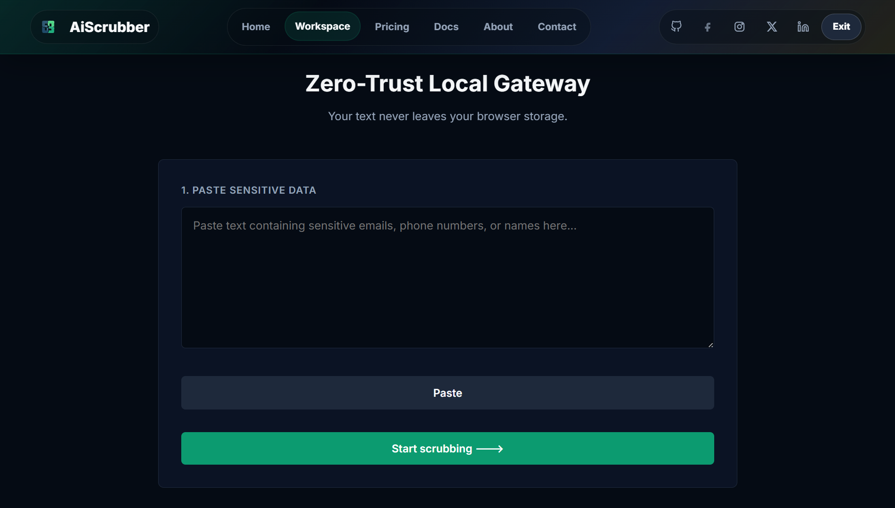

<div align="center">


# AiScrubber

**Client-side AI Privacy Scrubber**

*Sanitize sensitive data before it reaches any LLM — locally, instantly, for free.*

[](https://aiscrubber.vercel.app/)
[](#tech-stack)
[](#how-it-works)
[](LICENSE)
[](#pricing)

<br/>

[🚀 Launch website](https://aiscrubber.vercel.app/) · [📖 Documentation](https://aiscrubber.vercel.app/documentation.html) · [💬 Contact](https://aiscrubber.vercel.app/contact.html) · [🐛 Report Bug](../../issues)

<br/>

> *"Every unvetted prompt is a potential data breach."*

---

</div>

## 🔍 What is AiScrubber?

AiScrubber is a **browser-based privacy gateway** that detects and masks Personally Identifiable Information (PII) directly on your device — before your text is ever submitted to ChatGPT, Claude, Gemini, or any other public LLM.

No server. No account. No tracking. Your data never leaves your browser.

Built solo by **[Poorvith M P](https://github.com/prvthmpcypher)**.

---

## 🎯 The Problem

| Risk | What Happens |
|------|-------------|
| 🕵️ **Corporate Espionage** | Public AI models train on user inputs. Pasting proprietary code or strategy docs surrenders your IP permanently. |
| ⚖️ **Regulatory Breach** | Submitting unredacted patient data (HIPAA) or attorney-client communications through AI tools invites severe legal penalties. |
| 🔓 **Data Leakage** | Emails, phone numbers, SSNs, and IDs pasted into prompts are logged, stored, and potentially exposed. |

---

## ✅ The Solution

```
Paste raw text → AiScrubber detects PII → Replaces with safe placeholders → You copy clean output → Paste into any AI safely
```

Everything happens **in your browser RAM.** Nothing is sent anywhere.

---

## ⚡ Features

- 🔒 **Local-only processing** — Zero server round-trips. Ever.
- 🧠 **PII Detection Engine** — Regex-based detection of emails, phone numbers, IDs, and more
- 🏷️ **Smart Placeholder System** — Replaces sensitive data with tokens like `EMAIL_1`, `PHONE_2`
- 🗝️ **Encrypted Vault Export** — Password-protected keymap to reverse masking when needed
- 📄 **Multi-format Export** — Download sanitized output as TXT, DOC, PDF, or encrypted vault PDF
- ♻️ **Session Recovery** — Accidental tab close? Your last workspace is auto-recovered via `localStorage`
- 🌑 **Dark-first UI** — Clean, distraction-free workspace built for professionals
- 💸 **Free forever** — No account, no paywall, no ads

---

## 🖥️ Screenshots

> **Homepage — Hero**


> **Scrub Workspace**
*Paste → Scrub → Export*


---

## 🛠️ Tech Stack

| Layer | Technology |
|-------|-----------|
| **Markup** | HTML5 (semantic) |
| **Styling** | CSS3 (custom properties, animations, grid, flexbox) |
| **Logic** | Vanilla JavaScript ES6+ |
| **Fonts** | Inter + JetBrains Mono (Google Fonts) |
| **Storage** | Browser `localStorage` (no external DB) |
| **Exports** | Client-side file generation (jsPDF) |
| **Hosting** | Static deployment — no backend required |
| **Version Control** | Git + GitHub |

---

## 🚀 Getting Started

No installation needed. It's a static web app.

**Option 1 — Use it live:**
👉 [Launch AiScrubber](https://aiscrubber.vercel.app/)

**Option 2 — Run locally:**
```bash
git clone https://github.com/prvthmpcypher/aiscrubber.git
cd aiscrubber
# Open index.html in your browser — done.
```

No `npm install`. No build step. No dependencies. Just open and use.

---

## 📖 How It Works

```
┌─────────────────────────────────────────────┐
│             YOUR BROWSER (LOCAL)            │
│                                             │
│  Raw Text Input                             │
│       ↓                                     │
│  Regex PII Scanner                          │
│  (emails, phones, IDs detected)             │
│       ↓                                     │
│  Placeholder Replacement                    │
│  (EMAIL_1, PHONE_2, etc.)                   │
│       ↓                                     │
│  Vault Map Created (locally)                │
│       ↓                                     │
│  Clean Output → Copy to AI safely ✅        │
│                                             │
│  [Optional] Export encrypted vault PDF      │
└─────────────────────────────────────────────┘
              ↑ Nothing exits this box
```

---

## 👥 Built For

| Professional | Use Case |
|-------------|---------|
| ⚖️ **Legal Counsel** | Process NDAs and litigation files with cryptographic assurance |
| 🧑‍💼 **Human Resources** | Run resume parsing and performance analytics with full anonymity |
| 🏥 **Healthcare Administrators** | Use AI for clinical charting without exposing regulated patient data |
| 🔐 **Anyone using AI at work** | One-click safety layer before any prompt |

---

## 💰 Pricing

| Plan | Price | Features |
|------|-------|---------|
| **Community Protocol** | $0/mo | Client-side processing, regex sanitization, vault export, open-source |
| **Enterprise Vault** *(planned)* | TBD | Advanced entity recognition, API, team policy templates, priority SLA |

---

## 🧭 More from Poorvith M P

| Project | What it does |
|---|---|
| [SafeGen](https://github.com/prvthmpcypher/safegen) | Password generator that never leaves your browser |
| [PaperHive](https://github.com/prvthmpcypher/paperhive) | Offline-first PDF toolkit |
| [PortfolioGen](https://github.com/prvthmpcypher/portfoliogen) | Browser-only portfolio generator |
| [CypherPDF](https://github.com/prvthmpcypher/cypherpdf) | Clutter-free PDF reader for Android |

---

## 🗺️ Roadmap

- [x] Client-side regex PII detection
- [x] Encrypted vault export (PDF + file)
- [x] Session recovery via localStorage
- [x] Multi-format export (TXT, DOC, PDF)
- [ ] Advanced named entity recognition (NER)
- [ ] Browser extension
- [ ] API layer for enterprise teams
- [ ] Team policy templates
- [ ] More PII pattern coverage (SSN, passport, MRN)

---

## 🤝 Contributing

This is my first web app — feedback is genuinely appreciated.

1. Fork the repo
2. Create a branch: `git checkout -b feature/your-idea`
3. Commit: `git commit -m "add: your feature"`
4. Push: `git push origin feature/your-idea`
5. Open a Pull Request

Or simply [open an issue](../../issues) with your suggestion. 🙏

---

## 📜 Legal

- [Privacy Policy](privacy.html)
- [Terms of Service](terms.html)
- [Cookie Policy](cookies.html)
- [Community Guidelines](community-guidelines.html)

## 📄 License

Released under the [MIT License](LICENSE) — free to use, modify, and distribute.

---

## 📬 Connect

**Poorvith M P** — Indie developer, privacy-first tools

[](https://x.com/poorvithmp07)
[](https://www.linkedin.com/in/poorvithmp)
[](https://github.com/prvthmpcypher)

---

<div align="center">

© 2026 Poorvith M P · Independent, open-source project

*Built from scratch. Learned as I went. Shipped anyway.*

</div>
